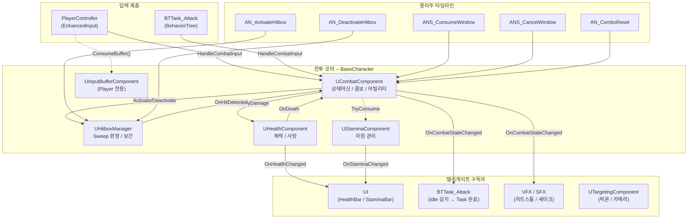
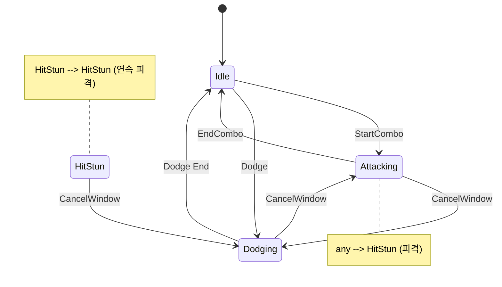
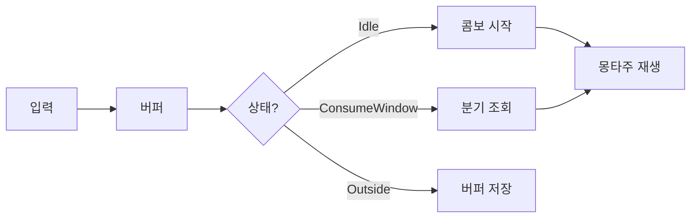
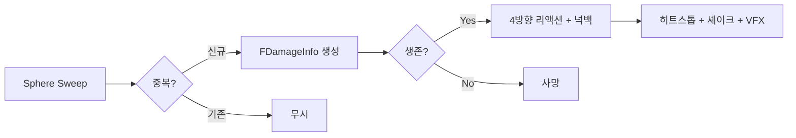
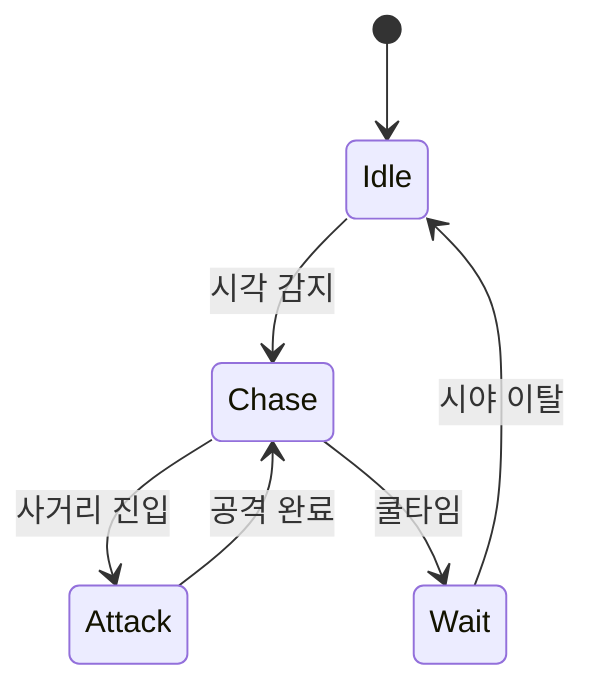
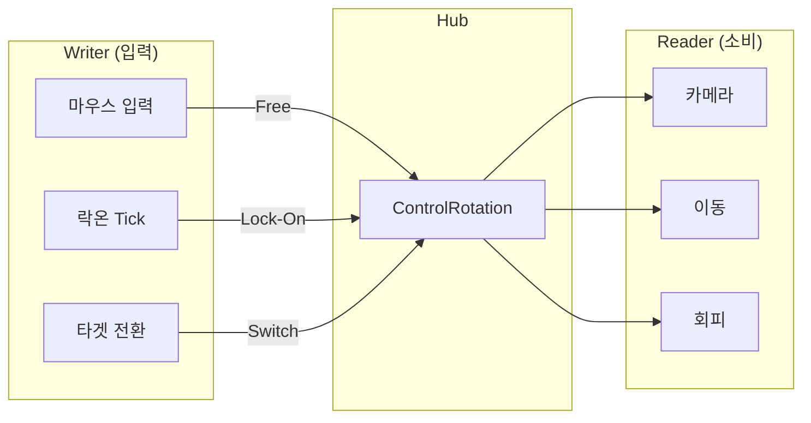

# CombatCore -- 3인칭 전투 시스템

[](https://www.unrealengine.com/)
[](https://isocpp.org/)
[](https://dev.epicgames.com/documentation/en-us/unreal-engine/behavior-tree-in-unreal-engine)

> 플레이어와 AI가 동일한 전투 파이프라인을 공유하는 3인칭 액션 전투 데모

**[시연 영상 보기](https://www.youtube.com/watch?v=PK9EOf7ynNw)**

---

## 프로젝트 소개

Unreal Engine 5.6 C++ 기반의 3인칭 전투 시스템입니다. 콤보, 회피, 히트 판정, 상태 머신, 타격감 연출, 적 AI, 락온 카메라까지 전투에 필요한 시스템 전체를 직접 설계하고 구현했습니다.

- **개발 기간**: 2026.03 ~ 2026.05
- **개발 인원**: 1인 개발
- **Unreal Engine**: 5.6

---

## 핵심 시스템

| 시스템 | 핵심 포인트 |
|--------|------------|
| 콤보 | DataAsset 기반 분기 + 시간 기반 입력 버퍼 |
| 히트 판정 | 무기 궤적 보간 Sphere Sweep + 중복 방지 |
| 데미지 | 다방향 피격 리액션 + 넉백 + FDamageInfo 통합 구조 |
| 상태 머신 | USTRUCT FSM + CancelWindow 전이 제어 |
| 회피 | CurveFloat 기반 속도 제어 + 무적 프레임 |
| 스태미나 | 공격/회피 자원 소비 + 자동 회복 |
| 타격감 | 히트스톱 + 양쪽 카메라 셰이크 + Niagara VFX |
| 적 AI | BehaviorTree 기반 근거리(Grux) / 원거리(Sparrow) |
| 락온 카메라 | ControlRotation 허브 패턴 + 타겟 전환 |

---

## 아키텍처

### 컴포넌트 통신 흐름

기능별로 독립 컴포넌트를 두고 델리게이트로 느슨하게 연결합니다. 새 구독자 추가 시 기존 코드 수정이 필요 없습니다.



> 실선 = 직접 호출 / 점선 = 조회 / 화살표 레이블 = 델리게이트명

### 클래스 계층

```
ABaseCharacter
├── UCombatComponent         전투 코어 (상태머신, 콤보, 어빌리티 실행)
├── UHitboxManager           히트 판정 (Sweep, 보간, 중복 방지)
├── UHealthComponent         체력 / 사망
├── UStaminaComponent        자원 관리
└── UTargetingComponent      락온 / 카메라 타겟팅

APlayerCharacter : ABaseCharacter
└── UInputBufferComponent    플레이어 전용 입력 큐

AEnemyCharacter : ABaseCharacter
└── (BT Task에서 CombatComponent 호출)

ARangedEnemyCharacter : AEnemyCharacter
└── 투사체 발사 (BaseProjectile)
```

---

## 시스템 상세

### 전투 상태 머신

전투 상태의 전이 규칙을 USTRUCT `FCombatStateMachine`이 소유하고, `UCombatComponent::TryChangeState`가 유일한 전이 실행 진입점입니다. 전이 성공 시 `OnCombatStateChanged` 델리게이트로 구독자(UI, AI, VFX)에 브로드캐스트합니다.



- **CancelWindow**: 특정 애니메이션 구간에서만 허용되는 전이. 공격-회피 양방향 및 피격 중 긴급 회피를 지원
- **2계층 분리**: 전이 규칙(USTRUCT, 순수 데이터) ↔ 전이 실행 + Broadcast(CombatComponent)
- **any → Dead**: 모든 상태에서 치명타 시 Dead 전이 가능 (종착점)

### 몽타주 타임라인

AnimNotify가 히트 판정, 콤보 분기, 캔슬 타이밍을 애니메이션 구간에 따라 주입합니다.

```
0%                                        100%
|  준비  |    스윙     |       후딜         |
          |HitboxON|OFF|
                        |ConsumeWindow     |
                              |CancelWindow|
                                          |Reset|
```

### 콤보 시스템

콤보의 각 단계를 `UComboDataAsset`으로 정의해 에디터에서 분기/몽타주/다음 스텝을 튜닝합니다. 코드 수정 없이 새 콤보를 추가할 수 있습니다.



- **시간 기반 입력 버퍼**: 프레임률에 무관하게 실시간 기반으로 선입력 보관
- **ConsumeWindow 우선**: 콤보 연계(자연스러운 흐름) → CancelWindow(긴급 전환) 순으로 판단
- **경공격 → 강공격 분기**: DataAsset의 `BranchComboData`로 경로 전환

### 히트 판정 + 데미지

무기 소켓 간 궤적을 여러 지점으로 보간해 빠른 스윙에서도 판정 누락을 방지합니다.



- **FDamageInfo**: Damage, KnockbackForce, KnockbackDirection, Instigator, HitStopDuration을 하나의 구조체로 전달
- **다방향 피격 리액션**: 공격자 위치 기준 Forward/Right 내적으로 방향별 리액션 자동 선택
- **중복 방지**: `TSet<AActor*>`로 한 스윙 내 같은 대상 재히트 차단

### 회피 시스템

Root Motion(애셋 종속) → LaunchCharacter(타이밍 불일치) → **CurveFloat 기반 Tick Velocity**(최종)의 탐색 과정을 거쳐 선택한 방식입니다.

- 제자리 애셋 + `UCurveFloat`로 속도를 직접 제어
- ControlRotation 기준 전방위 회피 (스틱 입력이 없으면 백스텝)
- `AnimNotifyState_InvincibleFrame`으로 무적 구간 관리
- 같은 커브 패턴을 공격 전진 임펄스에도 재활용

### 적 AI

AI가 플레이어와 동일한 `CombatComponent::HandleCombatInput` 경로로 공격을 실행합니다. AI 고유 판단(감지, 거리, 쿨타임)은 BehaviorTree + AIController가 담당합니다.



- **근거리 (Grux)**: 감지 → 추적 → 사거리 진입 시 콤보 공격 → 쿨타임 대기
- **원거리 (Sparrow)**: 투사체(`BaseProjectile`) 기반 공격 + `AnimNotify_FireProjectile`로 발사 타이밍 제어
- **BTTask_Attack 구독 패턴**: `OnCombatStateChanged`를 구독해 Idle 복귀 감지 → Task 완료. 몽타주 타이밍을 몰라도 동작

### 락온 카메라

ControlRotation을 허브로 사용하는 패턴입니다. 카메라, 이동, 회피가 항상 ControlRotation을 읽고 있으므로, 락온 시 Writer만 교체하면 Reader 쪽 코드 수정 없이 전체가 동작합니다.



- Sphere Trace로 후보 수집 → 화면 중심 거리 기준 최적 타겟 선택
- `SwitchTarget`: 스틱 방향으로 좌/우 타겟 전환
- 락온 인디케이터 위젯이 타겟 위치를 추적

### 타격감 연출

히트스톱, 카메라 셰이크, VFX/SFX를 조합해 무게감을 연출합니다.

- **히트스톱**: `CustomTimeDilation`으로 액터 단위 시간 정지. 경/강 공격별 강도 차등
- **카메라 셰이크**: 공격자/피격자 양쪽에 강도 차등 적용
- **스윙 트레일**: `AnimNotifyState_SwingTrail` + Niagara
- **임팩트 이펙트**: 경/강 분리된 Niagara 시스템 + 타격음
- 콤보 스텝별로 `FDamageInfo`에 연출 강도를 개별 지정 가능

---

## 프로젝트 구조

```
Source/CombatCore/
├── Character/
│   ├── BaseCharacter              # 공통 캐릭터 (컴포넌트 조립)
│   ├── PlayerCharacter            # 플레이어 (입력, 이동, 회피)
│   ├── EnemyCharacter             # 근거리 적
│   └── RangedEnemyCharacter       # 원거리 적
├── Combat/
│   ├── CombatComponent            # 전투 코어 (FSM, 콤보, 어빌리티)
│   ├── CombatTypes                # ECombatState, FCombatStateMachine, FDamageInfo
│   ├── CombatAbility              # 어빌리티 베이스 (몽타주 추적, 종료 처리)
│   ├── Ability_Dodge              # 회피 어빌리티
│   ├── ComboDataAsset             # 콤보 단계 정의 (DataAsset)
│   ├── HitboxManager              # Sweep 판정 / 궤적 보간
│   ├── HealthComponent            # 체력 / 사망
│   ├── StaminaComponent           # 스태미나 자원 관리
│   ├── InputBufferComponent       # 시간 기반 입력 버퍼
│   ├── TargetingComponent         # 락온 / 타겟 전환
│   └── BaseProjectile             # 투사체 베이스
├── AnimNotify/
│   ├── AN_ActivateHitbox          # 히트박스 활성화
│   ├── AN_DeactivateHitbox        # 히트박스 비활성화
│   ├── ANS_ConsumeWindow          # 콤보 분기 구간
│   ├── ANS_CancelWindow           # 캔슬 허용 구간
│   ├── AN_ComboReset              # 콤보 리셋
│   ├── ANS_InvincibleFrame        # 무적 프레임
│   ├── ANS_SwingTrail             # 스윙 트레일 VFX
│   ├── AN_SwingSound              # 스윙 사운드
│   └── AN_FireProjectile          # 투사체 발사
├── AI/
│   ├── EnemyAIController          # AI 감지 / 상태 관리
│   ├── BTTask_Attack              # 공격 Task (상태 구독 패턴)
│   ├── BTService_FindPlayer       # 플레이어 탐색 Service
│   └── EnemyAITypes               # AI 상태 Enum
├── UI/
│   ├── PlayerHUDWidget            # 플레이어 HUD
│   ├── HealthBarWidget            # 체력바
│   ├── StaminaBarWidget           # 스태미나바
│   └── LockOnIndicatorWidget      # 락온 인디케이터
└── Animation/
    └── BaseAnimInstance           # 애니메이션 블루프린트 베이스
```

---

## 기술 스택

| 분류 | 내용 |
|------|------|
| 엔진 | Unreal Engine 5.6 |
| 언어 | C++ (Epic Coding Standard) |
| 입력 | Enhanced Input System |
| AI | Behavior Tree + AI Perception |
| VFX | Niagara (스윙 트레일, 임팩트) |
| UI | UMG (HealthBar, StaminaBar, LockOn Indicator) |
| 설계 | Component 기반 + Delegate 통신 |

---

## 설치 및 실행

### 필요 조건

- Unreal Engine 5.6
- Visual Studio 2022 (Windows)
- Git

### 실행 방법

```bash
git clone https://github.com/minsforgh/CombatCore.git
cd CombatCore
```

1. `.uproject` 파일 우클릭 → "Generate Visual Studio project files"
2. Visual Studio에서 솔루션 열기 → 빌드
3. 에디터에서 Play

---

## 사용 에셋

| 에셋 | 용도 |
|------|------|
| [Mixamo](https://www.mixamo.com) -- Paladin J Nordstrom | 플레이어 캐릭터 + Great Sword 애니메이션 |
| [Paragon: Grux](https://www.unrealengine.com/marketplace/en-US/product/paragon-grux) | 근거리 적 캐릭터 + 애니메이션 |
| [Paragon: Sparrow](https://www.unrealengine.com/marketplace/en-US/product/paragon-sparrow) | 원거리 적 캐릭터 + 애니메이션 |
| [Runic Sword](https://www.fab.com) | 무기 메시 |
| [Freesound](https://freesound.org) | 타격음 / 스윙음 / 회피 효과음 (CC0) |

---

## 라이선스

이 프로젝트는 학습 목적으로 제작되었습니다.

---
